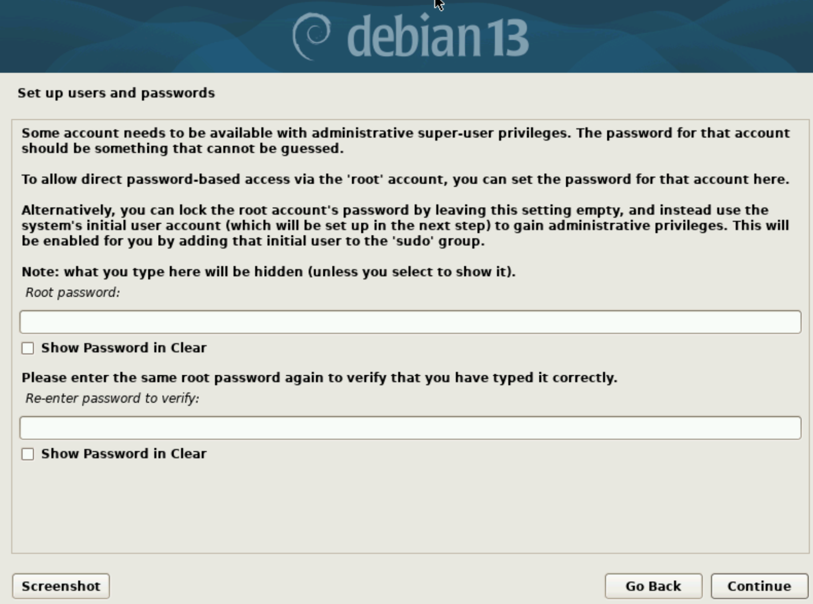
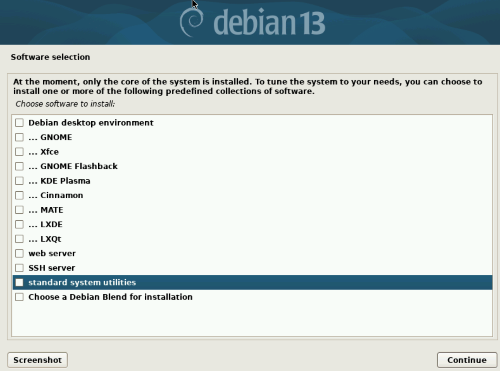

# sway kiosk based on debian 13
## pkgs
- sway 
- chromium
- xwayland
- sddm 
- jq
- git ca-certificates patch

## minimal debian 13 install 
1. install [debian 13 iso](https://cdimage.debian.org/debian-cd/current/amd64/iso-cd/debian-13.0.0-amd64-netinst.iso) and burn it to USB stick.
2. after booting via usb stick select **graphical install**
3. choose **English** -> **Other** -> **Asia** -> **Kazakhstan** -> **United States** -> **American English**
4. set **hostname: kiosk** -> **Domain name: leave empty** 
5. leave empty root password  ->
6. Fullname for new user: **kiosk** -> Username: **kiosk** -> set a password
7. choose a time zome -> 
8. partition disk **Guided - use entire disk** -> **select hard disk** -> **All files in one partition** -> **finish partitioning and write changes to disk** -> **yes** -> ->
9. configure package manager: **Kazakhstan** -> **deb.debian.org** -> HTTP proxy: **leave empty** -> surveys: **no** ->
10. software selection: **uncheck everything**  ->   
11. install the GRUB bootloader: **yes** -> **choose ur hard disk** -> 
12. reboot

## sway-kiosk installation
1. boot debian 13 and login
2. update and upgrade
```bash
sudo apt update && sudo apt upgrade -y```
3. install packages 
```bash
sudo apt install sddm  --no-install-recommends
sudo apt install sway git jq chromium xwayland```
4. clone repo
```bash 
git clone https://amir1330/sway-kiosk```
5. run sddm.sh
```bash 
./sway-kiosk/setup/sddm.sh``` 
7. reboot
8. Win + Enter to open terminal 
9. open chromium 
```bash 
chromium``
10. turn on dev mode and load extension
☰ -> settings -> extensions -> turn on **developer mode** -> **load unpucked** -> open /home/sway-kiosk/extensions/osk
11. dont forget to enable extension in incognito by going -> **details** -> and **allow in incognito**
12. in chromium setting go **language** -> and turn off **spell check** and **google translate** 
13. in terminal press **CTRL + C** to kill chromium window and 
```bash
./sway-kiosk/setup/install.sh```
14. done
